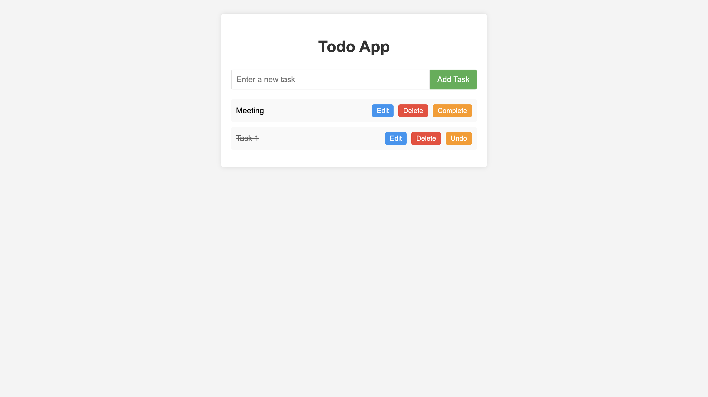

# Crudify Todo App

A simple, real-world **Todo App** powered by [Crudify.dev](https://www.crudify.dev) — built with vanilla HTML, CSS, and JavaScript.



> ✅ No backend setup required  
> 🔐 Authenticated API integration  
> 🚀 Real CRUD operations using a production-grade REST API

## ✨ Features

-   **Create, read, update, delete** todos with ease
-   **Secure API access** via bearer token authentication
-   **Clean, responsive UI** that works on all devices
-   **Real-time updates** when creating, editing, or deleting todos
-   **Zero dependencies** — built with pure HTML, CSS, and JavaScript

## 🛠️ Technology Stack

-   **Frontend:** HTML5, CSS3, JavaScript (ES6+)
-   **Backend:** [Crudify.dev](https://www.crudify.dev) REST API
-   **Authentication:** Bearer token

## 🚀 Getting Started

### Setup

1. **Clone the repository**

    ```bash
    git clone https://github.com/your-username/crudify-todo-app.git
    cd crudify-todo-app
    ```

2. **Open in browser**

    Simply open `index.html` in your browser. No build tools or bundlers required!

### API Authentication

1. Create an account or sign in at [Crudify.dev](https://www.crudify.dev)
2. Navigate to your Profile page
3. Copy your API token
4. Replace the `ACCESS_TOKEN` in `script.js`:

    ```javascript
    const ACCESS_TOKEN = "your-api-token-here";
    ```

## 📂 Project Structure

```
crudify-todo-app/
│
├── index.html     # Main HTML structure
├── style.css      # Styling and layout
├── script.js      # Application logic and API integration
├── screenshot.png # App preview image
└── README.md      # Project documentation
```

## 🤝 Contributing

Contributions are welcome! Feel free to open an issue or submit a pull request.

## 🙌 Credits

Built using [Crudify.dev](https://www.crudify.dev) — Real APIs for real developers.

## 📄 License

[MIT](LICENSE)
